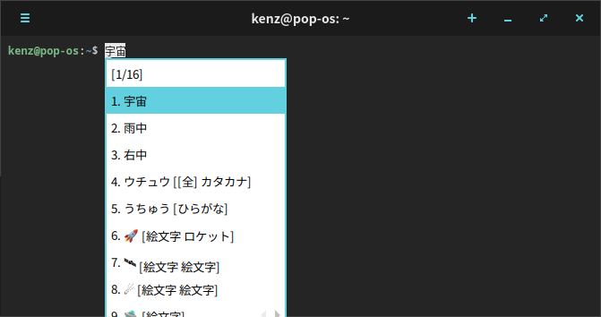
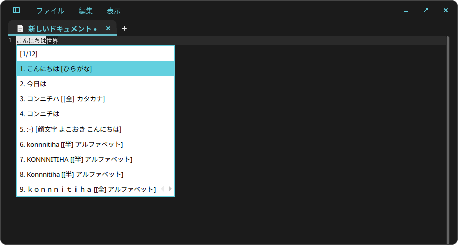
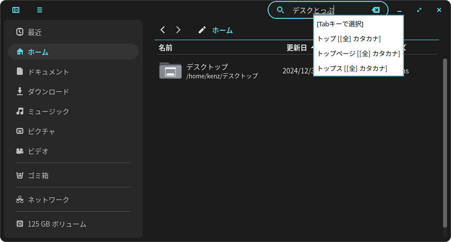
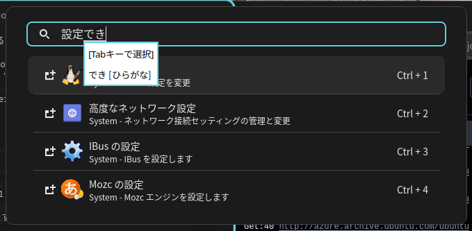
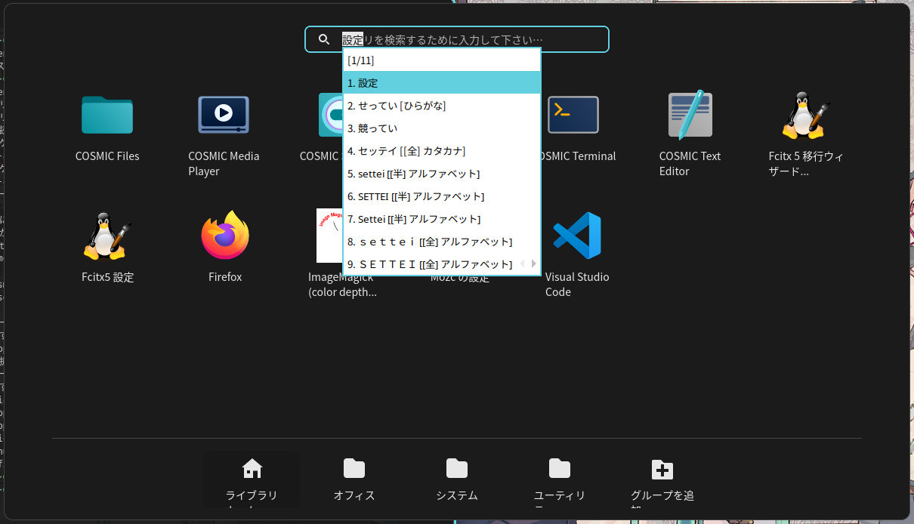

# IME enabled COSMIC Apps for Pop!_OS 24.04/Fedora

(ja: [日本語の説明はこちら](#cosmic-アプリ-日本語入力対応版リポジトリ))

**NEWS!**: Now there are RPM packages for Fedora.

This is **unofficial** APT/YUM repo. **Don't report bugs or issues to official** repos.

Since COSMIC apps do not currently support IME, there are issues inputting characters for languages that require an IME, such as Japanese, Chinese, and Korean.

While the latest version of the **iced** toolkit (which COSMIC apps use) has implemented IME support, it is expected to take several months before COSMIC apps officially adopt this latest version. Therefore, I have backported the IME support in advance to enable IME functionality for specific apps.



## Supported COSMIC Apps

[How to install](#how-to-install) (ja: [インストール方法](#インストール方法)).

|Package Name|Upstream Version|Fork or Patch|
|-|-|-|
|cosmic-term-**ime**|[epoch-1.0.5](https://github.com/pop-os/cosmic-term/releases/tag/epoch-1.0.5)|[Fork](https://github.com/kenz-gelsoft/cosmic-term/tree/backport-input-method2)|
|cosmic-edit-**ime**|[epoch-1.0.5](https://github.com/pop-os/cosmic-edit/releases/tag/epoch-1.0.5)|[Fork](https://github.com/kenz-gelsoft/cosmic-edit/tree/backport-input-method2)|
|cosmic-files-**ime**|[epoch-1.0.5](https://github.com/pop-os/cosmic-files/releases/tag/epoch-1.0.5)|[Patched `libcosmic`](https://github.com/pop-os/libcosmic/compare/master...kenz-gelsoft:libcosmic:backport-input-method)|
|cosmic-launcher-**ime**|[epoch-1.0.5](https://github.com/pop-os/cosmic-launcher/releases/tag/epoch-1.0.5)|[Patched `libcosmic`](https://github.com/pop-os/libcosmic/compare/master...kenz-gelsoft:libcosmic:backport-input-method)|
|cosmic-app-library-**ime**|[epoch-1.0.5](https://github.com/pop-os/cosmic-applibrary/releases/tag/epoch-1.0.5)|[Patched `libcosmic`](https://github.com/pop-os/libcosmic/compare/master...kenz-gelsoft:libcosmic:backport-input-method)|

## Screenshots

### cosmic-term-ime


### cosmic-edit-ime


### cosmic-files-ime


### cosmic-launcher-ime


### cosmic-app-library-ime


---

## How to Install

### for Pop!_OS 24.04

Add this public APT repository to your `/etc/apt/sources.list` and run `apt update`.

```shell
$ sudo sh -c "cat << EOF >> /etc/apt/sources.list
deb [trusted=yes] https://kenz-gelsoft.github.io/cosmic-ext-imenabled stable main
EOF"

$ sudo apt update
```

You can now install the desired apps via `apt install`. For example:

```shell
$ sudo apt install cosmic-term-ime
```

### for Fedora

Add this public YUM repository to your `/etc/yum.repos.d/*.repo`.

```shell
$ sudo sh -c "cat << EOF > /etc/yum.repos.d/cosmic-ext-imenabled.repo
[cosmic-ext-imenabled]
name=IME Enabled COSMIC Apps Repository
baseurl=https://kenz-gelsoft.github.io/cosmic-ext-imenabled
enabled=1
gpgcheck=0
EOF"
```

You can now install the desired apps via `dnf install --allowerasing`. For example:

```shell
$ sudo dnf install --allowerasing cosmic-term-ime
```

---

Following is Japanese translation.

# COSMIC アプリ 日本語入力対応版リポジトリ

これは**非公式** APT/YUM リポジトリです。不具合や問題を**公式リポジトリに報告しないでください**。

COSMIC アプリは IME に非対応のため、日本語・中国語・韓国語などの IME を必要とする言語の文字入力に問題があります。

COSMIC アプリが使っている **iced** ツールキットは最新版にて IME サポートが実装されましたが、COSMIC アプリが iced ツールキットの最新版を採用するにはまだ数ヶ月かかる見込みであるため、先行して IME サポートのみをバックポートして一部のアプリのみ IME が動作するようにしました。

## 対応済みの COSMIC アプリ

[こちら](#supported-cosmic-apps)

---

## インストール方法

### Pop!_OS 24.04

`/etc/apt/sources.list` にこのリポジトリから公開されている apt リポジトリを追加し、`apt update` します。
```shell
$ sudo sh -c "cat << EOF >> /etc/apt/sources.list
deb [trusted=yes] https://kenz-gelsoft.github.io/cosmic-ext-imenabled stable main
EOF"

$ sudo apt update
```

入れたいアプリを `apt install` できるようになります。例：
```shell
$ sudo apt install cosmic-term-ime
```

### Fedora

`/etc/apt/yum.repos.d/*.repo` にこのリポジトリから公開されている yum リポジトリを追加します。
```shell
$ sudo sh -c "cat << EOF > /etc/yum.repos.d/cosmic-ext-imenabled.repo
[cosmic-ext-imenabled]
name=IME Enabled COSMIC Apps Repository
baseurl=https://kenz-gelsoft.github.io/cosmic-ext-imenabled
enabled=1
gpgcheck=0
EOF"
```

入れたいアプリを `dnf install --allowerasing` できるようになります。例：
```shell
$ sudo dnf install --allowerasing cosmic-term-ime
```
